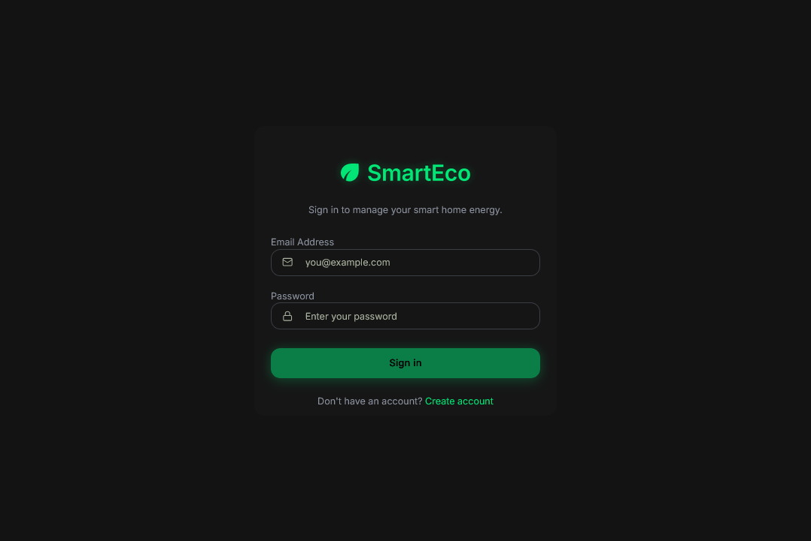
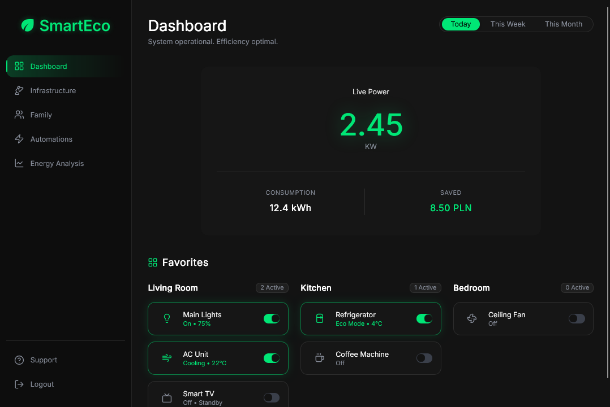
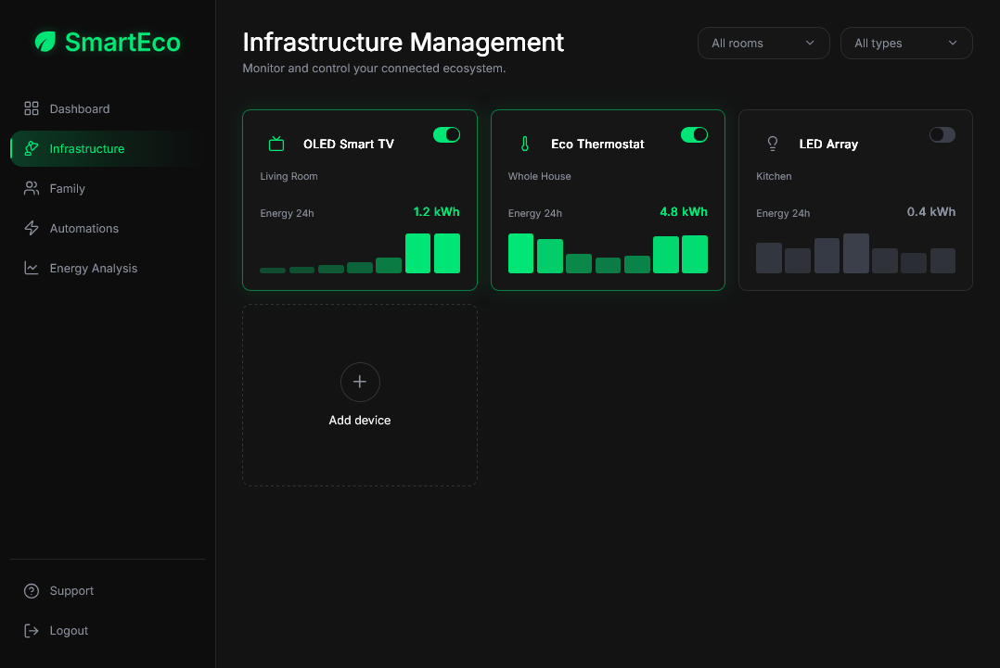
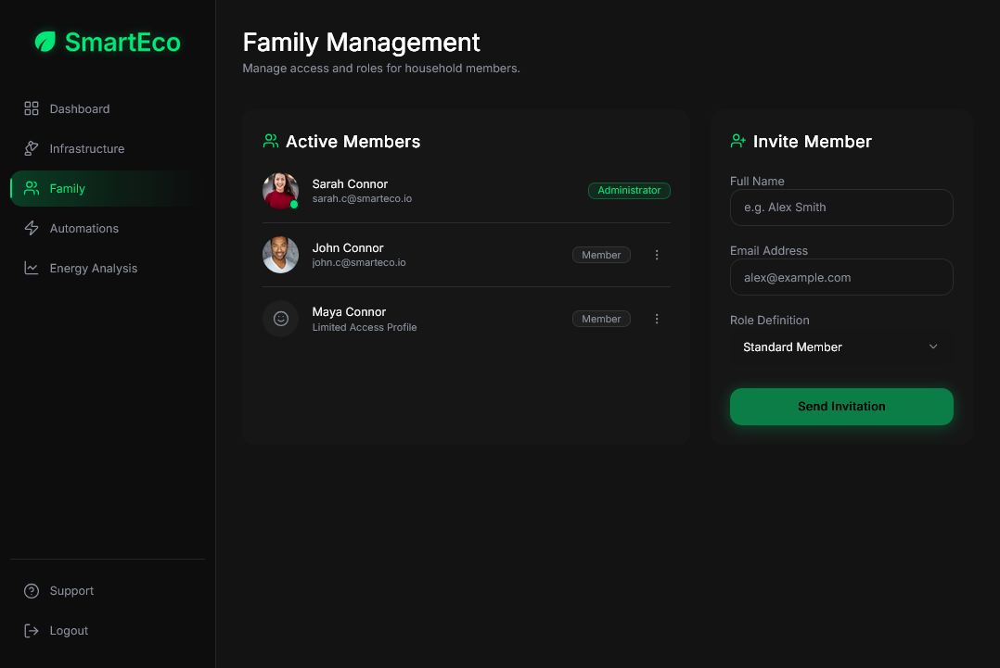
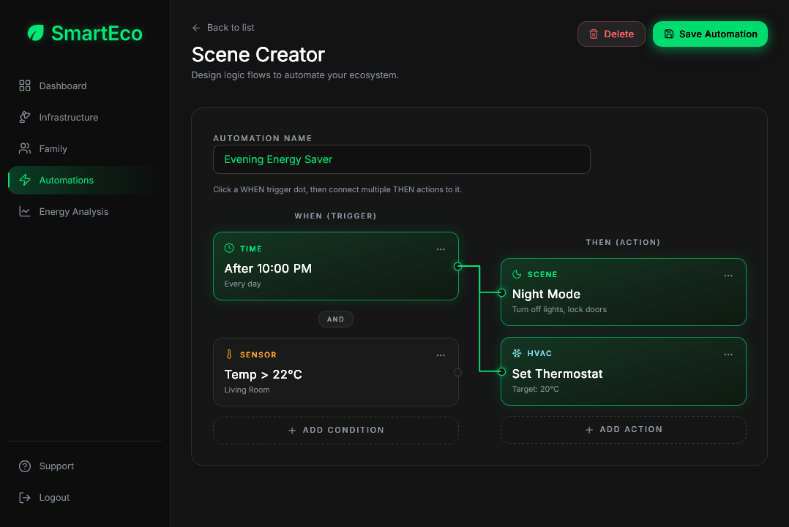
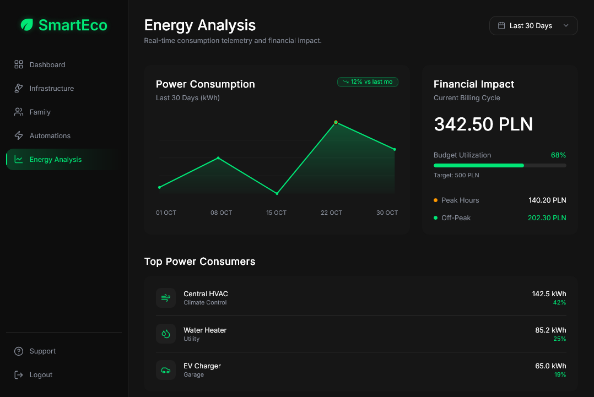

# SmartEco

SmartEco to aplikacja webowa do zarządzania energią w inteligentnym domu. Umożliwia monitorowanie zużycia mocy w czasie rzeczywistym, sterowanie podłączonymi urządzeniami, zarządzanie członkami gospodarstwa domowego, tworzenie automatyzacji oraz analizę trendów zużycia wraz z wpływem finansowym - wszystko z poziomu jednego, ciemnego panelu.

Repozytorium zawiera aplikację frontendową. Dane są dostarczane przez warstwę mock API, zaprojektowaną tak, aby w przyszłości można było podłączyć prawdziwy backend bez przepisywania interfejsu.

---

## Zrzuty ekranu
### Logowanie



### Panel główny



### Infrastruktura



### Rodzina



### Automatyzacje



### Analiza energii



---

## Funkcjonalności

### Panel główny (Dashboard)
- Odczyt mocy na żywo (kW) z podsumowaniem zużycia i oszczędności
- Zakładki zakresu czasu: dziś / tydzień / miesiąc
- Ulubione urządzenia pogrupowane według pomieszczeń z przełącznikami wł./wył.

### Infrastruktura
- Karty urządzeń z wykresami słupkowymi zużycia z ostatnich 24h
- Filtrowanie po pomieszczeniu i typie urządzenia
- Włączanie i wyłączanie urządzeń
- Dodawanie urządzenia - wpis ręczny i mock skanowania Bluetooth

### Rodzina
- Lista aktywnych członków z rolami i awatarami
- Zapraszanie nowych członków z wyborem roli
- Dynamiczna aktualizacja listy po wysłaniu zaproszenia

### Automatyzacje
- Lista zapisanych automatyzacji
- Wizualny edytor węzłów: wyzwalacze → akcje z połączeniami
- Tworzenie, edycja, zapisywanie i usuwanie automatyzacji

### Analiza energii
- Wykres liniowy zużycia mocy dla wybranych okresów (7 / 30 / 90 dni)
- Karta wpływu finansowego z wykorzystaniem budżetu i podziałem szczyt/poza szczytem
- Ranking największych konsumentów energii według udziału w zużyciu

### Autoryzacja i wsparcie
- Logowanie i rejestracja (mock auth, dane w `localStorage`)
- Chronione trasy - niezalogowani użytkownicy są przekierowywani na `/login`
- Okno wsparcia w panelu bocznym

---

## Stos technologiczny

| | |
|---|---|
| Framework | React 19 + TypeScript |
| Build | Vite 8 |
| Routing | React Router 7 |
| Stylowanie | Tailwind CSS 4 |
| UI | shadcn/ui, Radix UI, ikony Lucide |
| Czcionka | Inter |

---

## Uruchomienie projektu

### Wymagania

- Node.js 18+ ([nodejs.org](https://nodejs.org/))
- npm

### Instalacja i start

```bash
cd frontend
npm install
npm run dev
```

Otwórz **http://localhost:5173/** w przeglądarce.

### Pozostałe skrypty

```bash
npm run build 
npm run preview 
npm run lint 
```

---

## Konto demonstracyjne

Autoryzacja jest zamockowana. Zaloguj się używając:

```
Email:    user@smarteco.com
Hasło:    user123
```

Nowe konta można utworzyć pod adresem `/register`. Zarejestrowani użytkownicy są przechowywani w warstwie mock na czas bieżącej sesji przeglądarki.

---

## Struktura projektu

```
SmartEco/
├── frontend/
│   └── src/
│       ├── api/             
│       │   ├── auth/
│       │   ├── devices/
│       │   ├── summary/
│       │   ├── family/
│       │   ├── infrastructure/
│       │   ├── automations/
│       │   └── energy-analysis/
│       ├── components/  
│       │   ├── dashboard/
│       │   ├── family/
│       │   ├── infrastructure/
│       │   ├── automations/
│       │   ├── energy-analysis/
│       │   ├── auth/
│       │   ├── layout/
│       │   └── ui/    
│       ├── pages/    
│       ├── context/     
│       └── config/    
├── docs/
│   └── screenshots/
└── README.md
```

### Przepływ danych

Każda funkcja działa według tego samego wzorca:

```
Strona (stan + useEffect)
  → *Api.ts (asynchroniczny fetch, opóźnienie 150ms)
    → mock.ts (dane seed)
  → Komponenty (props w dół, callbacki w górę)
```

Odczyty używają `fetch*()` przy montowaniu komponentu. Zapisy (zaproszenie członka, przełączenie urządzenia, zapis automatyzacji) wywołują API, a następnie aktualizują lokalny stan. Podczas ładowania danych wyświetlane są szkielety (skeleton loaders).

Aby podłączyć prawdziwy backend, wystarczy zamienić ciała funkcji w plikach `api/*/*Api.ts` na prawdziwe wywołania HTTP. Strony i komponenty pozostają bez zmian.

---

## Trasy

| Ścieżka | Widok | Wymaga logowania |
|---|---|---|
| `/login` | Logowanie | Nie |
| `/register` | Rejestracja | Nie |
| `/` | Panel główny | Tak |
| `/infrastructure` | Infrastruktura | Tak |
| `/family` | Rodzina | Tak |
| `/automations` | Automatyzacje | Tak |
| `/energy-analysis` | Analiza energii | Tak |

---

## Design

- Ciemny motyw z kartami `#161616` i akcentem zielonym `#00E676`
- Responsywne siatki i nagłówki przełamujące się przy breakpointach `sm` / `lg` / `xl`
- Modułowe komponenty per funkcja, współdzielone prymitywy UI między widokami
